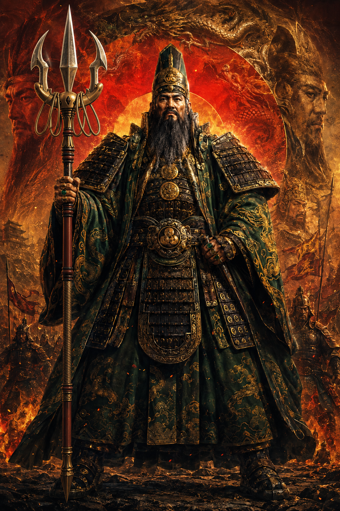

# Jang-Ji-Yargar

## 序

> 遥か昔。  
> 遠い宇宙の、遥か彼方。  
> 名も残らぬ国々が争った時代。
>
> 伝説の武将、Jang-Ji-Yargar（ジャング・ジ・ヤーガー）は、  
> 敵の綻びを見つけては、連鎖的に戦線を突破した。
>
> 敗れた兵は捕虜とせず、  
> その地へ標を立てたという。
>
> 三つの標が一直線に並んだとき、  
> 敵の地に再び太陽が昇ることはなかったという。
>
> その戦術を後世へ伝えるために作られた盤上遊戯。
>
> それが――**ジャンジャガ**である。

宿敵・Zung-Zoo-Gar

## ジャンジャガ

**じゃんけん連鎖と不可逆陣地を組み合わせた、5×5の2人対戦・完全情報アブストラクトゲーム。**

グー・チョキ・パーのユニットを配置・移動させ、相手の配置や移動に生じた綻びを見つけて戦闘を連鎖させます。

戦闘で負けたユニットは消滅し、そのマスには勝者固有の固定陣地 `●` が残ります。自分の `●` を縦・横・斜めのいずれかに3個連続させたプレイヤーの勝利です。

> 相手のミスを見つけ、なければミスが生じるよう誘導する。

## ゲームの特徴

- 5×5、計25マスの盤面
- グー・チョキ・パーによる3すくみ
- ユニットごとに異なる移動・攻撃方向
- 1つのターン内で両者のセグメントが交互に進行
- 移動と挑戦を順番に連鎖可能
- 敗者のマスが勝者の固定陣地 `●` へ変化
- `●` は移動も消滅もしない不可逆の盤面状態
- 自分の `●` の3連で即時勝利
- グーだけが1ゲーム通算5体の有限資源

将棋・チェス的な駒の読みと、陣取りゲーム的な盤面支配を組み合わせています。戦闘が起きるたびに盤面の地形が不可逆に変化する点が特徴です。

## ユニット

| 種類 | 表示 | 移動・攻撃方向 | 距離 | 使用数 |
|---|---:|---|---:|---|
| グー | ◯ | 斜め4方向 | 1マス | 各プレイヤー通算5体 |
| チョキ | V | 横2方向 | 1マス | 無制限 |
| パー | △ | 縦2方向 | 1マス | 無制限 |

ユニット固有の方向と距離は、移動と攻撃の両方に共通して適用されます。

## 基本的な勝敗

### 通常勝利

自分の固定陣地 `●` を、縦・横・斜めのいずれかに3個連続させると、その時点で勝利します。

### 盤面が埋まった場合

新しいユニットを配置できなくなった場合は、次の順で判定します。

1. `●`が多いプレイヤー
2. `●`が同数なら、盤上のユニットが多いプレイヤー
3. どちらも同数なら引き分け

## ターンの概要

1. ターン担当者が空きマスへユニットを1体配置する。
2. 配置したユニットは、その第1セグメントで最大1回だけ挑戦できる。
3. 相手の通常セグメントへ移る。
4. 以後、両者が通常セグメントを交互に行う。
5. 通常セグメントでは、条件を満たす移動と挑戦を順番に連鎖できる。
6. 両者が連続して終了を宣言するか、両者とも挑戦可能な行動を作れなくなると、そのターンを終了する。

戦闘では、挑戦側・守備側を問わず、じゃんけんに負けたユニットが消滅します。敗者のいたマスには勝者の `●` が残ります。

## 正式ルール

詳細なセグメント処理、移動条件、戦闘結果、ターン終了条件については、以下を参照してください。

- [ジャンジャガ ルール v0.1](./ジャンジャガ_ルール_v0.1.md)

## 名称

### 日本語名

**ジャンジャガ**

じゃんけんによる移動と戦闘が連鎖し、連鎖が決まると盤面をブルドーザーのように「ジャガジャガ」と薙ぎ進むイメージから命名しています。

### 英語名

**Jang-Ji-Yargar**  
（ジャング・ジ・ヤーガー）

## インスパイア元

本ゲームは、Rei murakami氏が「学生起業版 令和の虎」で発表したボードゲーム『ジャンケン並べてポン！』から着想を得ています。

- [「ジャンケン並べてポン！」プレゼン動画（YouTube）](https://youtu.be/4JrnvdE61V8)

5×5盤、敗者位置の固定陣地化、ユニット固有の移動、交互セグメント、連鎖戦闘、グーの通算制限などを加え、別のゲーム構造として設計しています。

## 開発状況

- ルール：v0.1
- コマ画像：制作中
- 盤面・UI：検討中
- プレイテスト：これから

現段階では、同一局面の反復、無限行動、千日手、持ち時間などの競技用規定は設けていません。必要が生じた段階で検討します。

---

### English summary

**Jang-Ji-Yargar** is a two-player, perfect-information abstract strategy game played on a 5×5 board. Players deploy rock, scissors, and paper units with distinct movement and attack directions. A defeated unit disappears, and its square becomes a permanent territory marker belonging to the winner. The first player to connect three of their territory markers vertically, horizontally, or diagonally wins.
